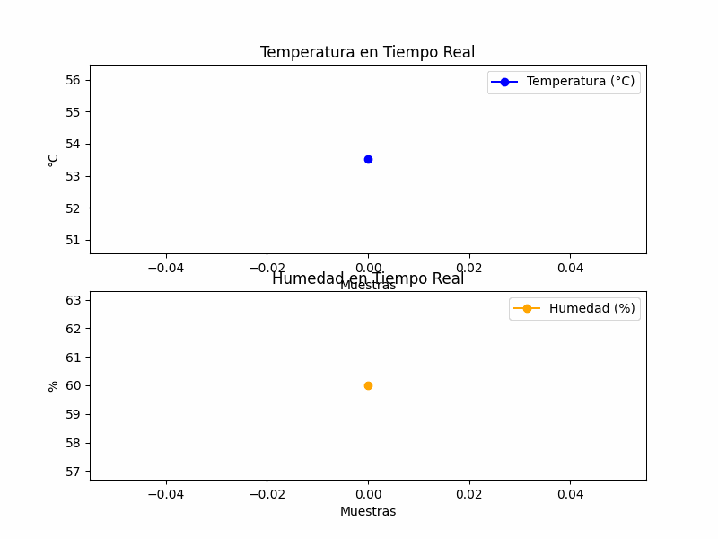

# IoT Kafka Sensor Simulation

Este proyecto simula sensores IoT que envían datos de temperatura, humedad y dirección del viento a un servidor Kafka. Los datos se comprimen en un payload de 3 bytes y se registran en logs, con visualización en tiempo real mediante gráficos. Al finalizar, se genera un GIF que muestra la evolución de los datos.

## Estructura del Proyecto

- **Producer**: Genera datos de los sensores, los codifica a 3 bytes y los envía al servidor Kafka.
- **Consumer**: Recibe, decodifica y visualiza los datos en tiempo real, guardando cada gráfico y generando un GIF animado al final.
- **Funciones de Codificación**: `encode_datos_sensor` y `decode_datos_sensor` comprimen y descomprimen el payload de 3 bytes.

## Captura del GIF Animado

A continuación, se muestra el GIF generado con la evolución de los datos en tiempo real:

## Requisitos

- Python 3.6+
- Librerías: `kafka-python`, `matplotlib`, `Pillow`

## Ejecución

1. Ejecuta el **Producer** para enviar datos simulados al servidor Kafka.
2. Ejecuta el **Consumer** para recibir y visualizar los datos, guardando logs y generando el GIF animado.

## Descripción de la Codificación

La función `encode_datos_sensor` comprime los datos en un formato de 3 bytes (24 bits), distribuyendo los bits como sigue:
- **Temperatura**: 14 bits
- **Humedad**: 7 bits
- **Dirección del Viento**: 3 bits

---

Este repositorio demuestra cómo optimizar el envío de datos en un entorno IoT usando Kafka y cómo manejar restricciones de payload de manera eficiente.
